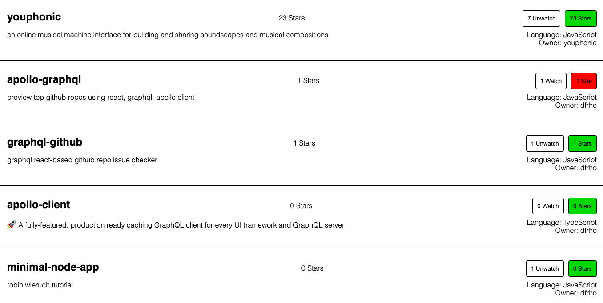

## React Application Using GraphQL and Apollo Client Consuming the GitHub API

##### Generates a summary of the top five-starred public Github repositories for the user.

Demo app: https://hardcore-wing-ad725a.netlify.com/

...but you can do anything you want with the view layer given what's available in the GitHub API and the permissions assigned to your [GitHub personal access token](https://help.github.com/articles/creating-a-personal-access-token-for-the-command-line/).

In an .env file in source directory add your GitHub personal access token defined as `REACT_APP_GITHUB_PERSONAL_ACCESS_TOKEN=notARealToken123456789`.

Clone the repo, then in the project directory, you can run:

`yarn install && yarn start`
